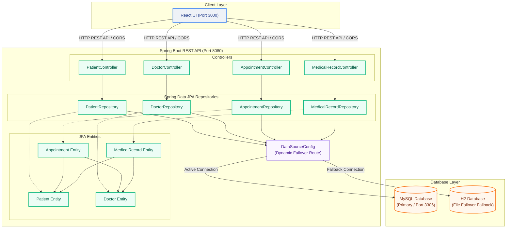

# REST API Layer (Java & Spring Boot)

This document provides the application variables, JPA Entity mappings, and exposed endpoints.

## 🏗️ System Architecture

The following diagram illustrates the 3-tier architecture of the PRMS application, including its controllers, JPA entities, database failover strategy, and front-end integration.




## 🛠️ Configuration Settings (`application.properties`)

```properties
spring.datasource.url=jdbc:mysql://localhost:3306/prms_db?useSSL=false&allowPublicKeyRetrieval=true
spring.datasource.username=root
spring.datasource.password=your_secure_password
spring.jpa.hibernate.ddl-auto=update
spring.jpa.show-sql=true
```

## 💻 Core Code Base

### 1. Data Object Mapping (`model/Patient.java`)
```java
package com.prms.model;

import jakarta.persistence.*;
import java.time.LocalDate;
import java.time.LocalDateTime;

@Entity
@Table(name = "patients")
public class Patient {
    @Id
    @GeneratedValue(strategy = GenerationType.IDENTITY)
    @Column(name = "patient_id")
    private Integer patientId;

    @Column(name = "first_name", nullable = false)
    private String firstName;

    @Column(name = "last_name", nullable = false)
    private String lastName;

    @Column(name = "date_of_birth", nullable = false)
    private LocalDate dateOfBirth;

    @Enumerated(EnumType.STRING)
    @Column(name = "gender", nullable = false)
    private Gender gender;

    private String phone;

    @Column(unique = true)
    private String email;

    private String address;

    @Column(name = "emergency_contact")
    private String emergencyContact;

    @Column(name = "created_at", insertable = false, updatable = false)
    private LocalDateTime createdAt;

    public enum Gender { Male, Female, Other }

    // Boilerplate Getters and Setters
    public Integer getPatientId() { return patientId; }
    public void setPatientId(Integer id) { this.patientId = id; }
    public String getFirstName() { return firstName; }
    public void setFirstName(String fn) { this.firstName = fn; }
    public String getLastName() { return lastName; }
    public void setLastName(String ln) { this.lastName = ln; }
    public LocalDate getDateOfBirth() { return dateOfBirth; }
    public void setDateOfBirth(LocalDate dob) { this.dateOfBirth = dob; }
    public Gender getGender() { return gender; }
    public void setGender(Gender g) { this.gender = g; }
    public String getPhone() { return phone; }
    public void setPhone(String p) { this.phone = p; }
    public String getEmail() { return email; }
    public void setEmail(String e) { this.email = e; }
    public String getAddress() { return address; }
    public void setAddress(String a) { this.address = a; }
    public String getEmergencyContact() { return emergencyContact; }
    public void setEmergencyContact(String ec) { this.emergencyContact = ec; }
    public LocalDateTime getCreatedAt() { return createdAt; }
}
```

### 2. JPA Repository Hook (`repository/PatientRepository.java`)
```java
package com.prms.repository;

import com.prms.model.Patient;
import org.springframework.data.jpa.repository.JpaRepository;
import org.springframework.stereotype.Repository;

@Repository
public interface PatientRepository extends JpaRepository<Patient, Integer> {
}
```

### 3. Web Service Controller Layer (`controller/PatientController.java`)
```java
package com.prms.controller;

import com.prms.model.Patient;
import com.prms.repository.PatientRepository;
import org.springframework.beans.factory.annotation.Autowired;
import org.springframework.http.ResponseEntity;
import org.springframework.web.bind.annotation.*;

import java.util.List;

@RestController
@RequestMapping("/api/v1/patients")
@CrossOrigin(origins = "http://localhost:3000") // Explicit React Port Routing
public class PatientController {

    @Autowired
    private PatientRepository patientRepository;

    @GetMapping
    public List<Patient> fetchAll() {
        return patientRepository.findAll();
    }

    @PostMapping
    public Patient registerNew(@RequestBody Patient patient) {
        return patientRepository.save(patient);
    }

    @DeleteMapping("/{id}")
    public ResponseEntity<Void> removePatient(@PathVariable Integer id) {
        if (!patientRepository.existsById(id)) {
            return ResponseEntity.notFound().build();
        }
        patientRepository.deleteById(id);
        return ResponseEntity.ok().build();
    }
}
```
